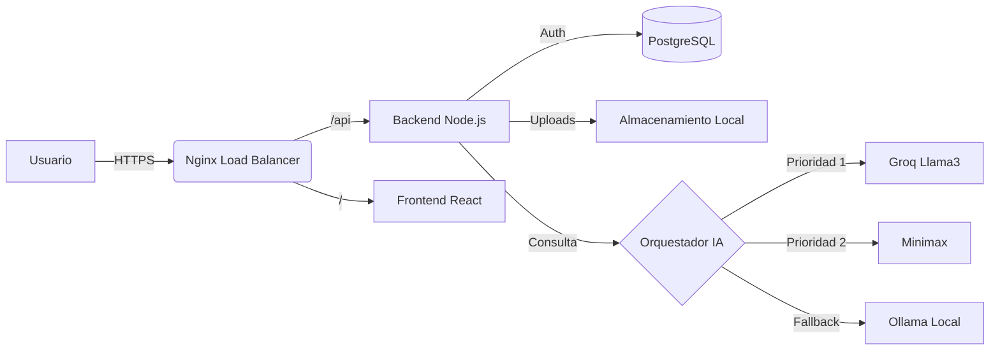

<!-- _class: lead -->
# **FacturaIA**

## Sistema Inteligente de Gestión Financiera

**Trabajo Final de Máster**
*Gestión contable potenciada por Inteligencia Artificial Generativa*

---

# 🚨 El Problema: Contabilidad Manual

1. **Gestión manual tediosa**
   Picar datos de facturas consume horas valiosas.

2. **Errores humanos**
   Equivocaciones al transcribir importes, fechas o conceptos.

3. **Datos desconectados**
   "Sé cuánto tengo en el banco, pero no cuánto gané realmente por proyecto".

---

# 💡 La Solución FacturaIA

Una plataforma integral que **automatiza** la contabilidad mediante IA Generativa.

- 🧾 **Extracción Automática**: De PDF a JSON estructurado en segundos.
- 🧠 **Clasificación Inteligente**: La IA decide si es "Infraestructura", "Personal" o "Marketing".
- 💬 **Asistente (RAG)**: Chat conversacional con tus datos financieros.
- 📊 **Dashboard Real-time**: KPIs y evolución financiera al instante.

---

# 🏗️ Arquitectura Técnica

Diseño modular basado en microservicios y contenedores.

---

# 🤖 Motor de Inteligencia Artificial (Híbrido)

Estrategia de **Fallback en Cascada** para optimizar coste y latencia:

| Proveedor | Modelo | Uso Principal | Ventaja |
| :--- | :--- | :--- | :--- |
| **1. Groq** | Llama 3-70b | Extracción rápida | Velocidad extrema (<1s) |
| **2. Minimax** | M2-her | Análisis complejo | Ventana de contexto enorme |
| **3. Ollama** | Llama 3.2 | Datos sensibles | Privacidad total y coste cero |

> *El sistema elige automáticamente el mejor proveedor disponible en tiempo real.*

---

# 🔍 RAG: Chat con tus Datos

No es solo un chat GPT genérico. Inyectamos **contexto financiero real**.

1. **Usuario**: *"¿Cuánto gasté en marketing este mes?"*
2. **Retrieval**: Buscamos facturas de categoría 'Marketing' y fecha 'Mes Actual'.
3. **Generation**: La IA recibe los datos: *"{ total: 1200€, items: [...] }"*.
4. **Respuesta**: *"Has gastado 1.200€, principalmente en campañas de Google Ads."*

---

# 🚀 Demo: Capturas de Pantalla

<!--
  AQUÍ PUEDES PEGAR UNA CAPTURA DE TU DASHBOARD REAL
  Ejemplo: 
-->

### Dashboard
Visión global del estado financiero.

### Chat con IA
Consultas en lenguaje natural.

---

# 📈 Diferenciación vs Tradicional

| Funcionalidad | Software Tradicional | **FacturaIA** |
| :--- | :--- | :--- |
| **Entrada de datos** | Manual (tecleo propenso a error) | **Automática (IA Vision)** |
| **Consultas** | Reportes estáticos y filtros | **Chat Conversacional** |
| **Flexibilidad** | Proveedor único | **Agnóstico (Multi-LLM)** |
| **Implementación** | On-premise complejo | **Docker Ready** |

---

# 🎯 Conclusiones y Próximos Pasos

- ✅ **Democratización de la IA**: Herramientas enterprise para pymes.
- ✅ **Eficiencia**: Reducción del 90% en tiempo administrativo.
- 🔮 **Futuro**:
    - App móvil con escáner de cámara.
    - Predicción de flujo de caja (Forecasting).
    - Integración bancaria directa (PSD2).

---

<!-- _class: invert lead -->

# ¡Gracias!

**FacturaIA**
*El futuro de la contabilidad es conversacional.*

[GitHub](https://github.com/nanci1121/TFM-facturas-ts) | [Demo](https://facturas.moralesluna.com)
